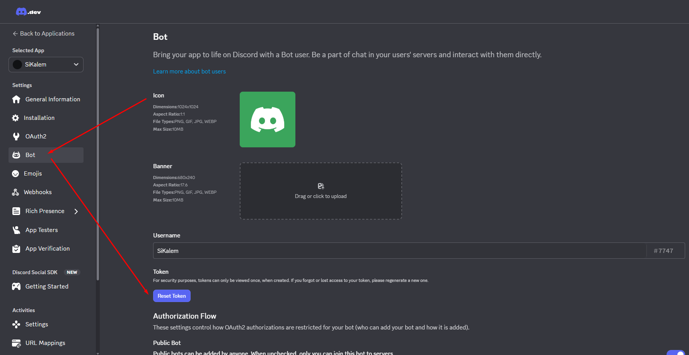
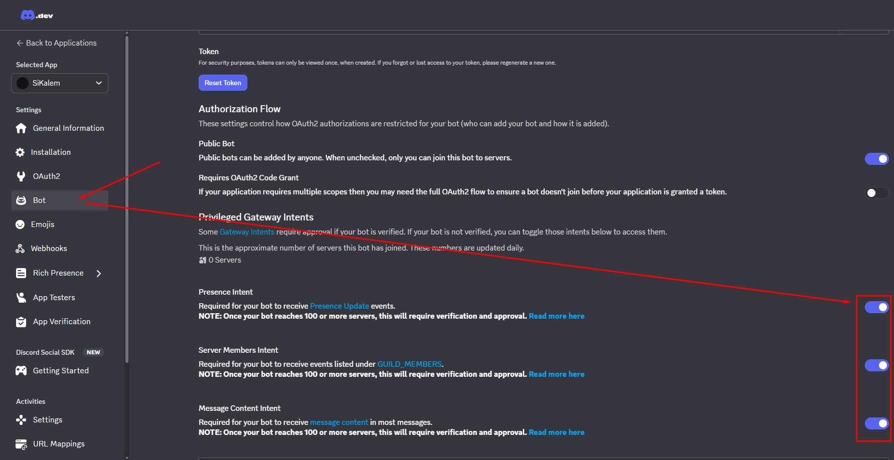
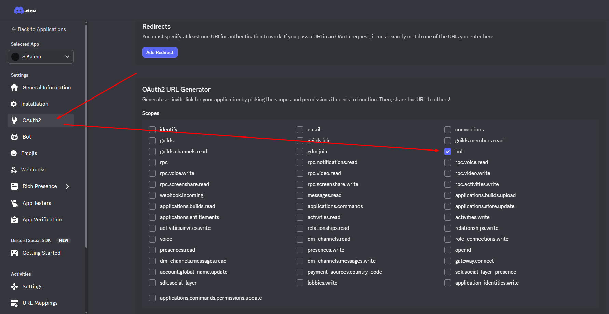
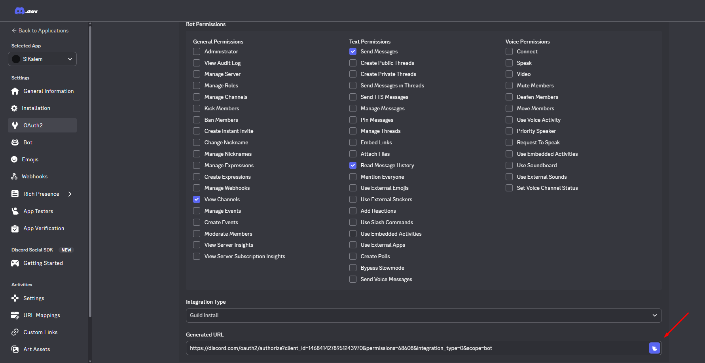
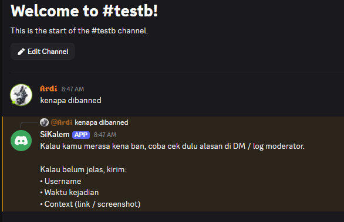

# Autorespond Chat Discord Bot

Bot Discord sederhana untuk membalas chat otomatis berdasarkan keyword (contoh: `kenapa dibanned`, `cara unban`).

Project ini ditulis untuk pemula yang belum pernah membuat bot Discord sama sekali.

## Fungsi Bot
- Membaca pesan baru di channel server Discord.
- Mengecek apakah pesan mengandung keyword tertentu.
- Membalas otomatis sesuai jawaban yang sudah kamu atur.
- Mengabaikan pesan dari bot lain agar tidak loop.

## Yang Perlu Disiapkan
- Node.js versi 18+ (disarankan LTS terbaru).
- Akun Discord.
- 1 server Discord untuk testing bot.
- Bot token dari Discord Developer Portal.

---

## Langkah 1 - Siapkan Bot di Discord Developer Portal (WAJIB)

Buka: [Discord Developer Portal](https://discord.com/developers/applications) lalu ikuti urutan ini.

### 1.1 Buat aplikasi dan bot
1. Klik **New Application**.
2. Masuk ke tab **Bot**.
3. Klik **Add Bot**.

### 1.2 Ambil token bot
1. Di tab **Bot**, klik **Reset Token**.
2. Copy token.
3. Simpan untuk nanti dimasukkan ke file `.env`.

> Penting: jangan pernah share token ke orang lain atau upload ke GitHub.



### 1.3 Aktifkan intent
Di tab **Bot** -> **Privileged Gateway Intents**:
- `Message Content Intent` -> **WAJIB**
- `Server Members Intent` -> opsional
- `Presence Intent` -> opsional



### 1.4 Buat link invite bot
Masuk tab **OAuth2** -> **URL Generator**

**Scopes:**
- `bot`



**Bot Permissions (minimal untuk balas chat):**
- `View Channels`
- `Send Messages`
- `Read Message History` (opsional tapi direkomendasikan)

Lalu copy URL yang dihasilkan.



### 1.5 Invite bot ke server
1. Buka URL invite tadi di browser.
2. Pilih server Discord kamu.
3. Klik authorize/add bot.


---

## Langkah 2 - Install Project dari GitHub

1. Clone repo:
   ```bash
   git clone <URL-REPO-KAMU>
   cd Autorespond-Chat
   ```
2. Install dependency:
   ```bash
   npm install
   ```

## Langkah 3 - Isi File Environment

1. Copy file contoh:
   ```bash
   copy .env.example .env
   ```
   Jika command `copy` tidak jalan, buat manual file `.env`.
2. Isi token:
   ```env
   DISCORD_TOKEN=isi_token_bot_kamu_di_sini
   ```

## Langkah 4 - Jalankan Bot

```bash
node index.js
```

Kalau sukses, terminal akan menampilkan bot online.

## Langkah 5 - Test Bot di Discord

Kirim pesan di channel server, contoh:
- `kenapa dibanned`
- `kenapa di banned`
- `cara unban`
- `minta unban`

Bot akan membalas otomatis.




---

## Kustomisasi Keyword & Balasan

Edit file `index.js`, bagian `rules`:
- `keywords`: kata pemicu
- `reply`: isi balasan otomatis

Contoh:
```js
{
  keywords: ["contoh keyword 1", "contoh keyword 2"],
  reply: "Ini balasan otomatis."
}
```

## Keamanan
- File `.env` sudah masuk `.gitignore` agar token tidak ikut terupload.
- Tetap pastikan kamu tidak pernah membagikan isi `.env`.

## Credits
Creator: **Ardi | SpawnEra.com** untuk belajar basic member **Terla** dan special untuk **Oziw**.
